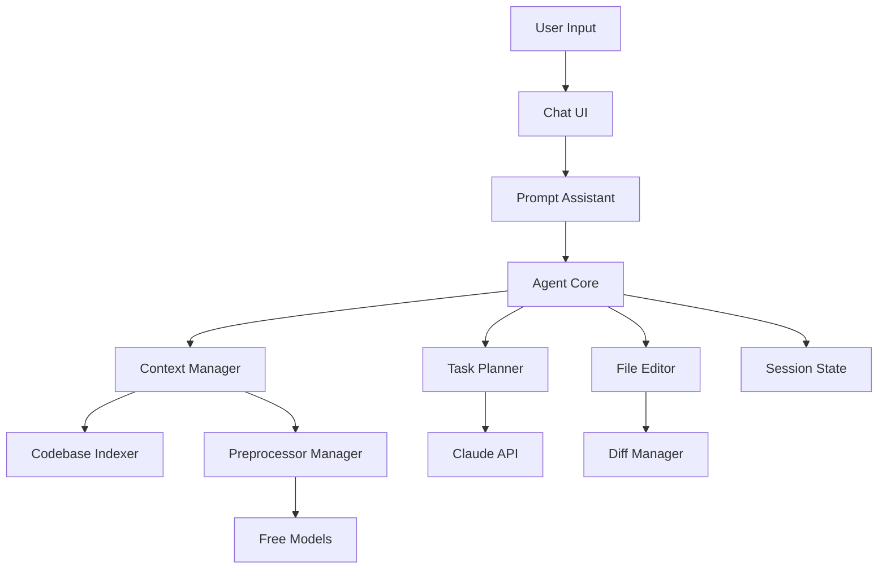

# Development Guide

This guide covers the architecture, development setup, and extension guidelines for the AI Code Agent VS Code extension.

## Architecture Overview

### Core Components



### Component Responsibilities

#### 1. **Agent Core** (`agentCore.ts`)
- Central orchestrator for all agent operations
- Manages task lifecycle (creation, execution, completion)
- Coordinates between planning, context gathering, and execution
- Handles error recovery and rollback

#### 2. **Task Planner** (`taskPlanner.ts`)
- Analyzes user requests and creates execution plans
- Estimates complexity and duration
- Identifies required capabilities and dependencies
- Generates step-by-step execution strategy

#### 3. **Context Manager** (`contextManager.ts`)
- Prepares relevant code context for LLM calls
- Implements smart chunking strategies
- Manages token budgets
- Handles context expansion for symbols

#### 4. **Codebase Indexer** (`codebaseIndexer.ts`)
- Builds searchable index of workspace
- Extracts symbols, imports, and exports
- Maintains file dependency graph
- Supports incremental updates

#### 5. **Preprocessor Manager** (`preprocessorManager.ts`)
- Integrates free/local models
- Handles file ranking and summarization
- Generates embeddings for semantic search
- Reduces load on paid API calls

#### 6. **File Editor** (`fileEditor.ts`)
- Safe file modification with preview
- Backup and rollback support
- Batch change operations
- Conflict detection

## Development Setup

### Prerequisites
- Node.js 18+ and npm
- VS Code 1.85.0+
- Git
- (Optional) Ollama for local models
- (Optional) Docker for testing

### Initial Setup

1. **Clone and Install**
   ```bash
   git clone <repository>
   cd ai-code-agent
   npm install
   ```

2. **Set Up Development Environment**
   ```bash
   # Create .env for development
   cp .env.example .env
   # Add your API keys for testing
   ```

3. **Install Ollama (for preprocessor testing)**
   ```bash
   # macOS/Linux
   curl -fsSL https://ollama.ai/install.sh | sh
   
   # Pull models
   ollama pull llama3
   ollama pull codellama
   ```

### Development Workflow

1. **Watch Mode**
   ```bash
   npm run watch
   ```

2. **Run Extension**
   - Press `F5` in VS Code
   - New VS Code window opens with extension loaded
   - Open a workspace for testing

3. **Debug**
   - Set breakpoints in TypeScript files
   - Use Debug Console for inspection
   - Check Output panel for logs

### Testing

```bash
# Run all tests
npm test

# Run specific test suite
npm test -- --grep "AgentCore"

# Run with coverage
npm run test:coverage
```

## Extension Guidelines

### Adding a New Preprocessor Model

1. **Define Model Configuration**
   ```typescript
   // In preprocessorManager.ts
   {
     id: 'new-model',
     name: 'New Model Name',
     type: 'api-type',
     capabilities: {
       embedding: true,
       summarization: true,
       codeAnalysis: true,
       contextSize: 8192,
       costPerMillion: 0
     },
     config: {
       endpoint: 'https://api.example.com',
       modelName: 'model-v1'
     }
   }
   ```

2. **Implement Model Client**
   ```typescript
   private async callNewModel(prompt: string): Promise<string> {
     // Implementation
   }
   ```

3. **Add to Configuration Schema**
   ```json
   // In package.json
   "enum": ["llama3", "gemini-1.5-pro", "new-model"]
   ```

### Adding a New Task Type

1. **Create Task Template**
   ```typescript
   // In taskPlanner.ts
   ['new-task-type', {
     requiredCapabilities: ['capability1', 'capability2'],
     risks: [
       {
         description: 'Risk description',
         severity: 'medium',
         mitigation: 'How to mitigate'
       }
     ]
   }]
   ```

2. **Implement Task-Specific Steps**
   ```typescript
   // In generateTaskSpecificSteps()
   if (descLower.includes('new-task')) {
     steps.push({
       id: 'new-task-1',
       type: 'edit',
       description: 'Task description',
       // ... other properties
     });
   }
   ```

3. **Add Prompt Template**
   ```typescript
   // In promptAssistant.ts
   {
     id: 'new-task-template',
     name: 'New Task Type',
     category: 'category',
     template: 'Template with {variables}',
     // ... other properties
   }
   ```

### Adding UI Components

1. **Create New Webview Provider**
   ```typescript
   export class NewViewProvider implements vscode.WebviewViewProvider {
     resolveWebviewView(
       webviewView: vscode.WebviewView,
       context: vscode.WebviewViewResolveContext,
       _token: vscode.CancellationToken
     ) {
       // Implementation
     }
   }
   ```

2. **Register in Extension**
   ```typescript
   // In extension.ts
   context.subscriptions.push(
     vscode.window.registerWebviewViewProvider(
       'new-view-id',
       new NewViewProvider(context)
     )
   );
   ```

3. **Add to package.json**
   ```json
   "views": {
     "ai-agent-sidebar": [
       {
         "id": "new-view-id",
         "name": "New View"
       }
     ]
   }
   ```

## Best Practices

### Code Style
- Use TypeScript strict mode
- Prefer async/await over promises
- Use descriptive variable names
- Add JSDoc comments for public APIs
- Follow ESLint rules

### Error Handling
```typescript
try {
  await riskyOperation();
} catch (error) {
  // Log for debugging
  console.error('Operation failed:', error);
  
  // User-friendly message
  vscode.window.showErrorMessage(
    'Operation failed. Check logs for details.'
  );
  
  // Recovery or rollback
  await this.rollbackChanges();
}
```

### Performance
- Lazy load heavy modules
- Use streaming for large files
- Implement cancellation tokens
- Cache expensive computations
- Batch API calls when possible

### Security
- Never log sensitive data
- Validate all user inputs
- Use VS Code's secret storage
- Sanitize file paths
- Implement rate limiting

## Debugging

### Common Issues

**Extension not loading**
```bash
# Check compilation errors
npm run compile

# Check for missing dependencies
npm ls
```

**API calls failing**
```typescript
// Add debug logging
if (this.debugMode) {
  console.log('API Request:', { endpoint, params });
}
```

**Memory issues**
```bash
# Run with increased memory
NODE_OPTIONS=--max-old-space-size=4096 code
```

### Debug Configuration

Add to `.vscode/launch.json`:
```json
{
  "version": "0.2.0",
  "configurations": [
    {
      "name": "Run Extension",
      "type": "extensionHost",
      "request": "launch",
      "args": [
        "--extensionDevelopmentPath=${workspaceFolder}",
        "--disable-extensions"
      ],
      "outFiles": [
        "${workspaceFolder}/out/**/*.js"
      ],
      "preLaunchTask": "${defaultBuildTask}",
      "env": {
        "DEBUG": "ai-agent:*"
      }
    }
  ]
}
```

## Testing Strategy

### Unit Tests
```typescript
// Example test
describe('AgentCore', () => {
  let agentCore: AgentCore;
  
  beforeEach(() => {
    agentCore = new AgentCore(
      mockApiKeyManager,
      mockModelManager,
      mockIndexer,
      mockPreprocessor
    );
  });
  
  it('should execute simple task', async () => {
    const result = await agentCore.executeTask('test task');
    expect(result.status).to.equal('completed');
  });
});
```

### Integration Tests
- Test with real VS Code APIs
- Use test workspace with sample files
- Mock external API calls
- Test error scenarios

### E2E Tests
- Test complete workflows
- Verify UI interactions
- Check file system changes
- Validate session persistence

## Release Process

1. **Version Bump**
   ```bash
   npm version patch/minor/major
   ```

2. **Build and Test**
   ```bash
   npm run compile
   npm test
   npm run package
   ```

3. **Publish**
   ```bash
   vsce publish
   ```

## Performance Profiling

### CPU Profiling
```typescript
// Start profiling
console.profile('operation-name');
await heavyOperation();
console.profileEnd('operation-name');
```

### Memory Profiling
- Use Chrome DevTools
- Take heap snapshots
- Monitor memory timeline
- Identify memory leaks

## Contributing

### Pull Request Process
1. Fork the repository
2. Create feature branch
3. Write tests for new features
4. Ensure all tests pass
5. Update documentation
6. Submit PR with clear description

### Code Review Checklist
- [ ] Tests added/updated
- [ ] Documentation updated
- [ ] No console.logs in production
- [ ] Error handling implemented
- [ ] Performance impact considered
- [ ] Security implications reviewed

## Resources

- [VS Code Extension API](https://code.visualstudio.com/api)
- [Anthropic API Docs](https://docs.anthropic.com)
- [TypeScript Handbook](https://www.typescriptlang.org/docs/)
- [VS Code Extension Samples](https://github.com/microsoft/vscode-extension-samples)